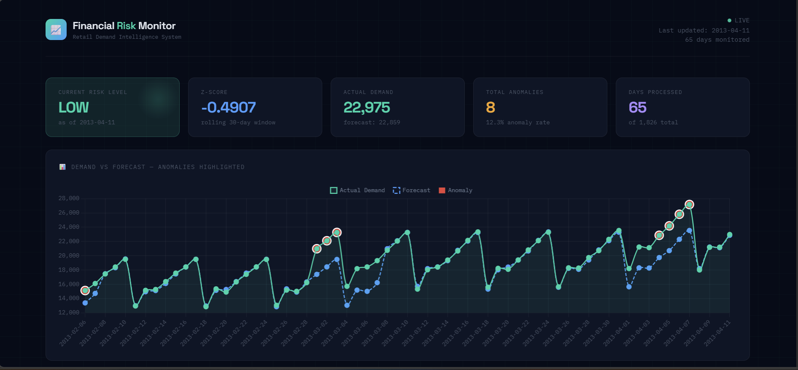
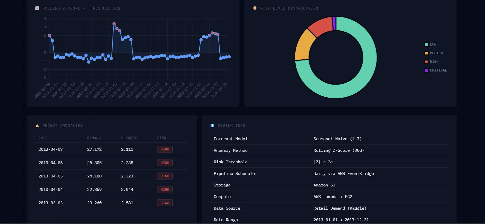

# 🚀 Financial Risk Monitoring System (AWS | Data Science + Data Engineering)

An end-to-end cloud-native Financial Risk Monitoring System that combines statistical anomaly detection with automated AWS data pipelines and containerized deployment.

This project demonstrates the integration of Data Science modeling with production-grade Data Engineering infrastructure.

---

## 📊 Live Dashboard Preview

## 📉 Risk & Anomaly Modeling Visuals

---

# 🎯 Project Objective

Retail demand volatility can introduce financial and operational risk due to unexpected spikes or drops in sales.

The objective of this project was to:

- Design a statistically sound anomaly detection system
- Build an automated AWS batch processing pipeline
- Deploy a containerized dashboard for real-time monitoring
- Demonstrate separation of storage, compute, and presentation layers

---

# 📌 Resume-Ready Summary

Designed and deployed a hybrid Data Science and Data Engineering solution on AWS using S3, container-based Lambda, EventBridge, EC2, ECR, IAM, and Docker; implemented rolling Z-score anomaly detection with automated batch processing and live dashboard visualization.

---

# 🏗 Architecture Overview

The system is built using a layered cloud architecture:

### 🔹 Storage Layer

- Amazon S3 (raw data + processed risk outputs)

### 🔹 Compute Layer

- AWS Lambda (container-based deployment via Amazon ECR)

### 🔹 Scheduling Layer

- Amazon EventBridge Scheduler (cron-based daily execution)

### 🔹 Presentation Layer

- Amazon EC2 (Dockerized dashboard application)

### 🔹 Security

- IAM roles with least-privilege access
- MFA enabled for root user

---

# 📊 Data Science Methodology

### Forecasting Approach

- Seasonal Naive Forecast (t-7 baseline)

### Anomaly Detection

- Rolling 30-day Z-score
- Threshold: |Z| ≥ 2 standard deviations

Rolling Z-score dynamically normalizes demand deviations relative to recent volatility,
allowing the system to detect anomalies even under seasonal shifts.
This avoids false positives that occur when using static thresholds.

### Risk Classification

- Low
- Medium
- High
- Critical

This approach standardizes demand deviations relative to historical volatility and allows consistent anomaly detection across time.

---

# ⚙️ Data Engineering Pipeline

1. Raw retail demand data stored in Amazon S3
2. EventBridge triggers Lambda daily
3. Lambda:
   - Loads data from S3
   - Computes forecast baseline
   - Calculates rolling Z-score
   - Detects anomalies
   - Assigns risk levels
   - Writes processed output back to S3

4. EC2-hosted dashboard reads latest processed file
5. Dashboard visualizes risk metrics

The system is fully automated and runs without manual intervention.

---

# 🐳 Containerization & Deployment

- Docker used for:
  - Lambda processing image
  - Dashboard application

- Images pushed to Amazon ECR
- Lambda configured with container image
- EC2 instance runs dashboard container
- Public access configured via security groups

This ensures reproducible builds and environment consistency.

---

## 🚀 Live Deployment

Deployed on AWS EC2 using Dockerized containers with public access configured via security groups.

🔗 [Live Demo on AWS EC2](http://18.117.170.153:8000/)

## Note: EC2 instance may sleep when inactive (Free Tier).

# ☁️ AWS Services Used

- Amazon S3
- AWS Lambda (container image deployment)
- Amazon EventBridge Scheduler
- Amazon EC2 (t3.micro – Free Tier)
- Amazon ECR
- AWS IAM

---

# 📊 Dashboard Features

- Demand vs Forecast visualization
- Anomaly highlighting
- Rolling Z-score trend chart
- Risk distribution chart
- KPI summary cards
- Recent anomaly table

---

# 💡 Key Highlights

- Combines statistical modeling with cloud-native architecture
- Serverless batch processing
- Container-based Lambda deployment
- Automated scheduling
- Decoupled compute and storage
- Public cloud deployment
- Free-tier optimized

---

# 🔮 Future Enhancements

- CI/CD via GitHub Actions
- CloudWatch monitoring
- Infrastructure as Code (Terraform)
- API Gateway integration
- HTTPS via Application Load Balancer

---

## 👩‍💻 Author

Foram Dilip Panchal
Data Scientist | Data Engineer
